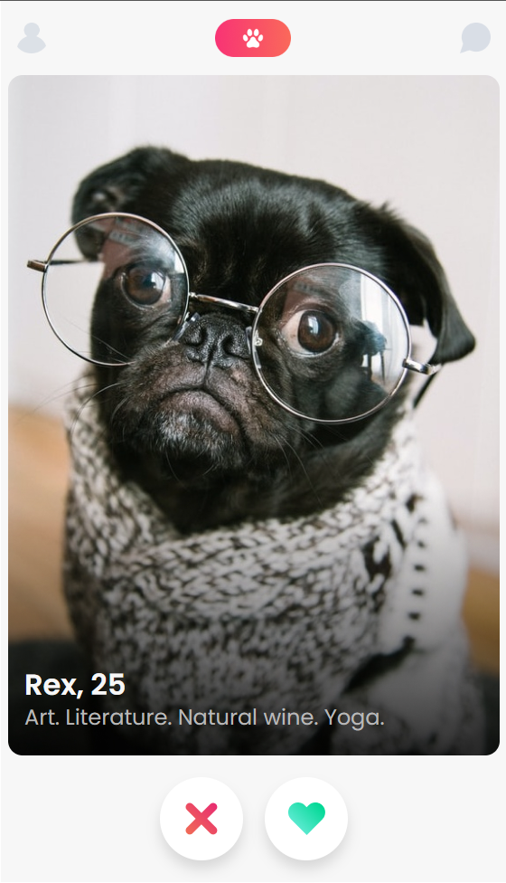
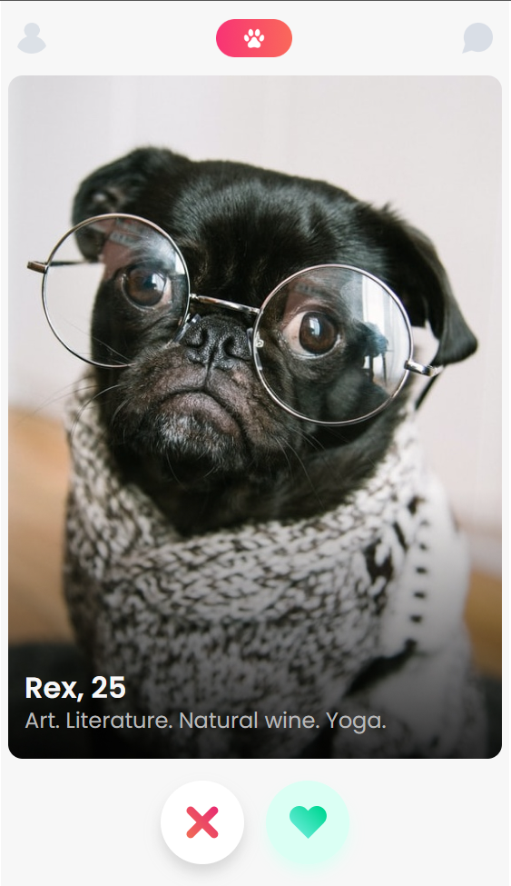
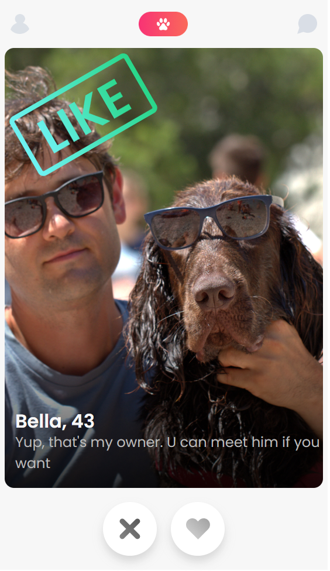
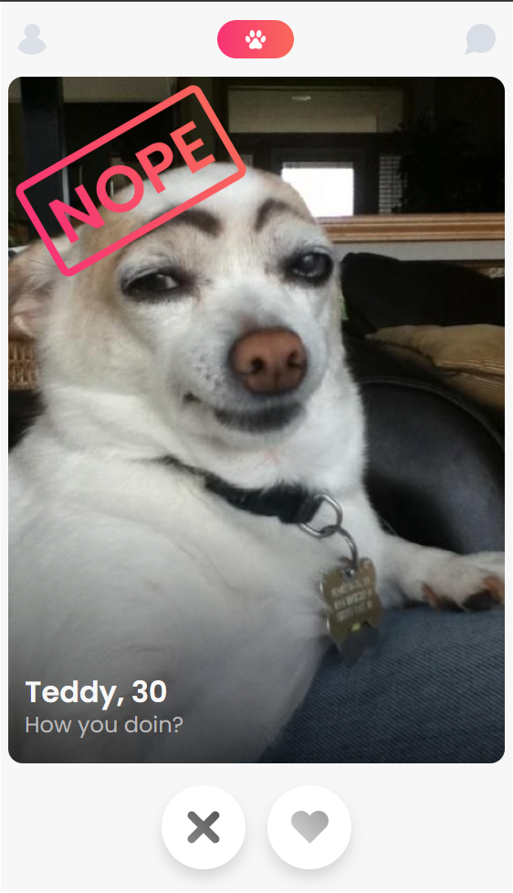

# Scrimba - The Frontend Developer Carrer Path - Module 7 - Tindog web application project

Hello and welcome! Thank you for stopping by.🤠

This is a solution to the Tindog web application project from _Module 7 - Next-level JavaScript_ of the [The Frontend Career Path](https://scrimba.com/learn/frontend).

## Table of contents

- [Overview](#overview)
  - [The project](#the-challenge)
  - [Screenshot](#screenshot)
  - [Links](#links)
- [My process](#my-process)
  - [Built with](#built-with)
  - [What I learned](#what-i-learned)
  - [Continued development](#continued-development)
- [Author](#author)
- [Acknowledgments](#acknowledgments)
- [About Scrimba](#about-scrimba)

## Overview

### The project

The Tindog web application allows users to do following:

- Like or reject the displayed dog profile
- Continue searching if you have already viewed all profiles

### Screenshot

Default

Hover states

Button clicked

No more profiles

### Links

- Solution URL: [Github Repository](https://github.com/PetrValenta92/tindog)
- Live Site URL: [Github Pages](https://petrvalenta92.github.io/tindog/)

## My process

### Built with

- Semantic HTML5 markup
- CSS custom properties
- Flexbox
- Mobile first design
- Accessibility focus design
- Responsive design
- Javascript modules
- Javascript classes

### What I learned

I learned to split my javascript code into modules. I also learned how to export and import data from a database file and further work with it using JS classes.

### Continued development

I would like to expand the database with more profiles in the future. If a user exhausted all profiles, he/she could have all profiles he/she liked and rejected displayed.

## Author

- Website - _to be added..._
- GitHub - [@PetrValenta92](https://github.com/PetrValenta92)
- LinkedIn - [@valentapetr](https://www.linkedin.com/in/valentapetr/)
- Instagram - [@petr_thedev](https://www.instagram.com/petr_thedev/)

## Acknowledgments

I would love to thank whole [Scrimba](https://scrimba.com) team for such amazing project they have created. I want to thank the Scrimba community and specialy the [Junior Guru Community](https://junior.guru/) community! 🐣

## About Scrimba

At Scrimba our goal is to create the best possible coding school at the cost of a gym membership! 💜
If we succeed with this, it will give anyone who wants to become a software developer a realistic shot at succeeding, regardless of where they live and the size of their wallets 🎉
The Frontend Developer Career Path aims to teach you everything you need to become a Junior Developer, or you could take a deep-dive with one of our advanced courses 🚀

- [Our courses](https://scrimba.com/allcourses)
- [The Frontend Career Path](https://scrimba.com/learn/frontend)
- [Become a Scrimba Pro member](https://scrimba.com/pricing)

Happy Coding!
